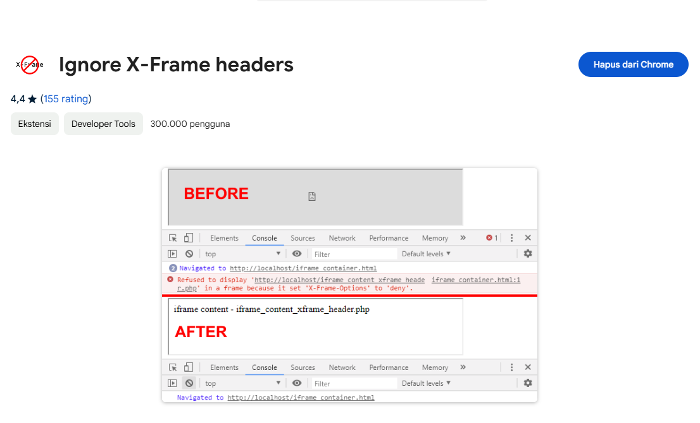
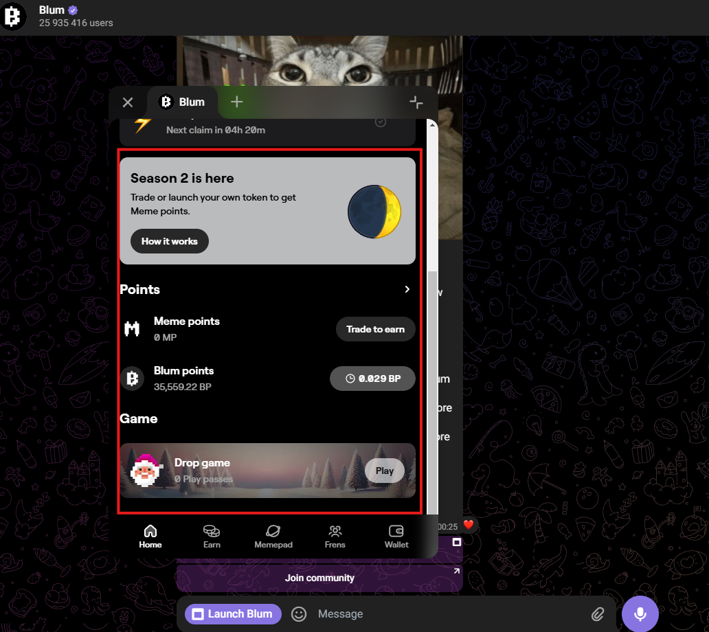
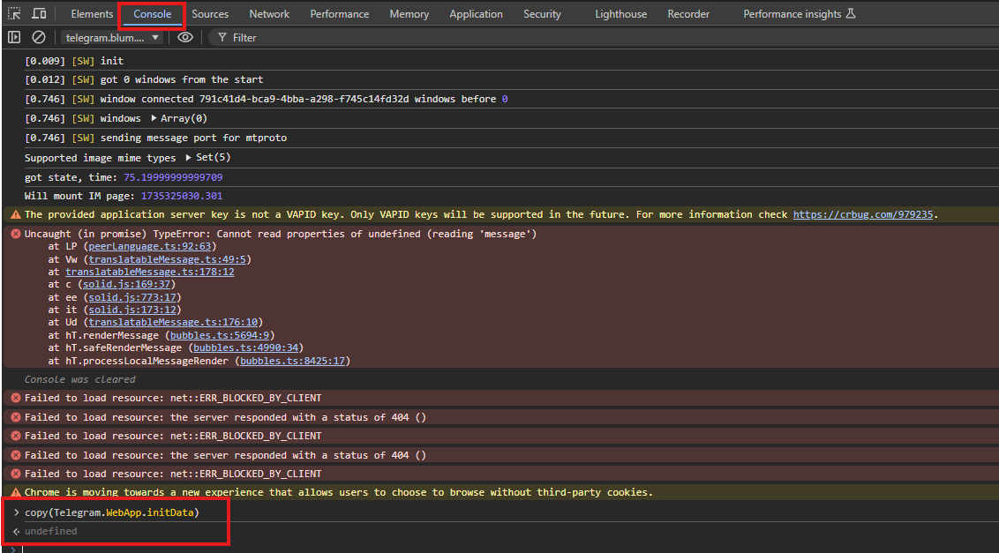

# blum bot tutorials


---
### how to use .exe file (for my non IT friends)
1. install [ignore-x-frame-headers](https://chromewebstore.google.com/detail/ignore-x-frame-headers/gleekbfjekiniecknbkamfmkohkpodhe?hl=id) on chrome or [ignore-x-frame-options-header](https://addons.mozilla.org/en-US/firefox/addon/ignore-x-frame-options-header/) if you use firefox


2. login to [telegram web](https://web.telegram.org/)
3. launch blum on telegram web
4. Right Click anywhere on the red area
 
5. choose inspect
6. go to console tab
7. type `allow pasting` (note: you need to type it manually)
8. then copy and paste this script into console `copy(Telegram.WebApp.initData)` (now you have your login credential in your clipboard, do not share this to anyone)

9. go download the latest version release zip from (https://github.com/hikaaam/blum_auto_claim/releases/tag/main)[https://github.com/hikaaam/blum_auto_claim/releases/tag/main]
10. extract the zip file
11. right click on `accounts.json` open with notepad
12. paste your login credential that you get from step 8 into `accounts.json` and save it 
important !!
you have to paste it correctly in this exact format (just add double qoute`""` in first and last, it will look like this)
```json
[
    "yourlogincredential"
]
```
13. save and done just run the .exe (make sure accounts.json and .exe file on the same folder)
---
14. multiple accounts? if you have multiple account just logout telegram web and login with different account, and follow step 3 to 8.
14. now to paste in `accounts.json`, you need the same format but add comma into previous account
it should look like this.
```json
[
    "yourlogincredential1",
    "yourlogincredential2",
    "yourlogincredential3"
]
```
last account should not have comma.

---
### how to use `index.gs` file a.k.a google app script (you need a little bit of coding skill)

Google app script is used to automatically run your script without having to execute it manually, i am not gonna explain you in detail how to use this, because it need coding skill.

if you insist want to make an automate app script without coding skill, i have detailed tutorial on genshin hoyolab login page, just take a look there as reference https://github.com/hikaaam/hoyolab-auto-login-multi-account

now back to blum app script tutorial :

1. go create a [google app script](https://script.google.com/) app
1. paste the `index.gs` into you project
1. go find variable name `accounts` and add your login credential there
1. do a test run on `mainFunction`
1. go add a trigger (on the left side of icon)
1. choose which function to run select on `mainFunction`
1. select interval i suggest every 6 hours or 12 hours
1. after that click save
1. and you have automated it, congratulations 👏
